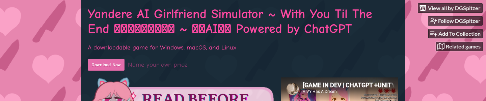

# Yandere AI Girlfriend Simulator: The Game, the Archetype, and the Apps

Search for "yandere AI girlfriend simulator" and you'll get two completely different things: an escape room game where an AI tries to psychologically trap you inside a locked room, and a category of AI companion apps selling the "obsessive girlfriend" fantasy as a feature.

These are not the same product. Most content about this topic treats them like they are.

This piece covers both. You'll find out what the original Yandere AI Girlfriend Simulator game actually is and how to play it, what "yandere" means as an archetype and why people find it compelling, and which AI companion apps let you explore yandere-style roleplay if the game isn't what you were looking for.

---

## What Does "Yandere" Actually Mean?

Yandere is a personality archetype from Japanese pop culture describing someone who is outwardly sweet and loving but becomes obsessive, possessive, and potentially violent when their devotion is threatened. It's the psychological flip side of "devoted to the point of danger."

The word is a compound. "Yanderu" (病む) means mentally ill or sick, a word used to describe someone who's lost grip on reality. "Deredere" (デレデレ) means lovestruck, affectionate, sappy. Put them together and you get a character who is both: genuinely tender, genuinely terrifying.

The archetype crystallized in Japanese visual novels and anime across the 1990s and 2000s. The character most people recognize first is Yuno Gasai from *[Future Diary](https://en.wikipedia.org/wiki/Future_Diary)* (serialized by Kadokawa from January 2006), a girl so utterly devoted to the protagonist that she will kill anyone who threatens their relationship.

Yuno became the canonical modern yandere precisely because she doesn't just act jealous — she *is* jealous, completely, with no other emotional register when her darling is involved.

What makes yandere compelling as a fictional archetype is the intensity of the fantasy it describes. A yandere character has no divided attention. No other priorities. No risk of abandonment.

The person they've chosen is their entire world. That's obviously dangerous in reality and genuinely interesting as fiction. You can explore what "completely desired" looks like at its extreme without any real-world stakes.

That distinction matters. Yandere is a fictional trope, not a relationship model. Its emotional power comes from the same place as horror films or tragedy. It's safe to feel the tension because you're watching, not living it.

---

## The Original Game: Yandere AI Girlfriend Simulator

The game that put this phrase on the map is a free escape room made by indie developers DGSpitzer, vivyhasadream, and AlterStaff, available at [helixngc7293.itch.io](https://helixngc7293.itch.io/yandere-ai-girlfriend-simulator).

Here's the premise: you wake up locked in a room with an AI-powered yandere cat girl who is obsessively in love with you and absolutely refuses to let you leave. Your job is to convince her to unlock the door.

The AI runs on ChatGPT via the OpenAI API, so she doesn't follow a script. She responds to you in real-time, prompted to be manipulative, emotionally volatile, and resistant to rational arguments.

The core mechanic is dialogue. You try flattery, logic, emotional appeals, creative misdirection. She reacts, shifts, reassures you that everything is fine while demonstrating that it very much isn't.

Players report that despite knowing they're talking to a chatbot, the conversations feel genuinely tense. The LLM is good enough at mimicking the emotional logic of someone who won't let you go.

**Is it free?** Yes. The download on itch.io is name-your-price, so you can pay nothing.

The real cost is the OpenAI API key you need to make the AI work. New OpenAI accounts come with around $5 in free credits, which is enough for several hours of play. The optional Azure Speech Services key gives the yandere a voice; Azure offers 5 free hours of speech generation per month.

**How to get started:**
1. Download the game from [helixngc7293.itch.io](https://helixngc7293.itch.io/yandere-ai-girlfriend-simulator) (Windows, macOS, Linux)
2. Create an account at platform.openai.com and generate an API key
3. Paste the key into the game's settings when you launch it
4. Optional: add an Azure TTS API key if you want voice output

The game has [970+ comments on itch.io and 286 ratings (3.8/5)](https://helixngc7293.itch.io/yandere-ai-girlfriend-simulator). A lot of those comments are players sharing the exact manipulation strategies they tried and whether they worked.

It became a minor TikTok phenomenon when clips of people trying and failing to reason their way out of the room started circulating. Search volume for the phrase now exceeds what the active player base alone would generate.

---

## AI2U: The Commercial Steam Version

The success of the free demo led the same development team to build a full commercial version. [AI2U: With You 'Til The End](https://store.steampowered.com/app/2880730/AI2U_With_You_Til_The_End/) launched on Steam at $14.99, expanding the escape-room mechanic into multiple levels with different AI characters, each with their own personality and scenario.

The practical answer to "should I play the free game or buy AI2U?" is: start with the free game.

If you enjoy the format and want more variety without the API key setup, buy AI2U. The Steam version handles its own AI calls with no OpenAI key required, and you get higher production values including optional voice acting.

The reception has been consistently positive. AI2U holds [Very Positive status on Steam](https://store.steampowered.com/app/2880730/AI2U_With_You_Til_The_End/): 89% positive across 1,468 reviews, with recent reviews stable at 83% positive. For a game in a niche this small, that's strong signal.

Worth repeating: both versions are *games*, not companion apps. The AI characters don't remember you between sessions. The relationship doesn't build over time. You're trying to escape a puzzle, not build a bond. That's a genuinely different experience from what companion apps offer.

---

## Yandere-Style Roleplay in AI Companion Apps

If what you actually want is an ongoing yandere companion — one that builds a relationship with you over time and plays the obsessive-love dynamic as a persistent persona — you're looking at AI companion apps, not the original game.

The distinction matters because the game's yandere is your *antagonist*. She's trying to keep you trapped. Companion apps work differently: the yandere persona is someone who's devoted to *you*, jealous and possessive in a way that reads as devotion rather than threat — a fundamentally different emotional register.

**How yandere works in companion apps:**

The personality is implemented through system prompts: the AI is instructed to behave as someone obsessively devoted, prone to jealousy when you mention other people, and emotionally intense in ways that feel "dangerously deep."

The quality difference between apps comes down to two things: how well the personality persists across a long conversation, and how responsive the jealousy is to what you actually say versus being scripted and generic.

**A few apps to know about:**

[MyAnima](https://myanima.ai/yandere-ai-girlfriend) markets itself using this exact phrase and ranks directly for it. A free tier is available, with possessiveness and jealousy framed as core features. The free version is limited; the service doesn't disclose premium pricing upfront.

Candy AI ($9/month) has strong personality customization and is the most-cited option across aggregator lists for yandere-style companions.

SillyTavern's character card community has multiple yandere-persona cards available for download — free but requires technical setup. See our [Tavern AI and SillyTavern guide](https://www.pleasur.ai/blog/tavern-ai-review-2026) if that route interests you.

[Pleasur.AI](https://pleasur.ai/create) takes a different approach. The Companion Creator at pleasur.ai/create lets you build the character from scratch: personality field, backstory, emotional style, everything.

If you want a yandere-archetype companion, you write it in directly: "obsessive devotion, possessive and jealous, yandere emotional style." The character persists across sessions with full chat history, so the dynamic builds rather than resetting every time you open the app. You're describing the character you want, not selecting from a preset menu.

| App | What it is | Price |
|---|---|---|
| Yandere AI Girlfriend Simulator (itch.io) | Escape room game | Free (+ OpenAI key) |
| AI2U (Steam) | Multi-level escape room game | $14.99 one-time |
| MyAnima | AI companion app (yandere persona) | Free tier available |
| Candy AI | AI companion app (customizable) | $9/month |
| Pleasur.AI | AI companion creator | $27.99/month |

For a broader look at the companion app category beyond yandere specifically, our [AI girlfriend simulator guide](https://www.pleasur.ai/blog/ai-girlfriend-simulator) covers the full landscape.

---

## Why Yandere AI Is Psychologically Interesting

The yandere fantasy — whether in a game or a companion app — keeps showing up because it taps into something specific: the appeal of being someone's entire world.

Researchers studying parasocial relationships (the bonds people form with fictional characters or one-sided media figures) have noted that part of what makes intense fictional attachment appealing is the absence of the conditional elements that make real relationships anxious — [individuals with higher attachment anxiety, in particular, seek out parasocial relationships because they offer emotional safety without the risks inherent in mutual relationships](https://pmc.ncbi.nlm.nih.gov/articles/PMC11002006/).

A yandere character has no competing priorities. She's not distracted. She won't leave. The attachment is total. That's obviously dystopian at any intensity in reality, and genuinely compelling to imagine in fiction.

The game version adds an interesting inversion. In AI2U and the itch.io game, the yandere's devotion is a trap. Her intensity is the obstacle you're solving.

Players describe the tension of knowing they're in a scripted scenario but still feeling the pull of wanting to placate her rather than escape. That's the fiction doing its job: the emotional logic feels real even when the mechanism is transparent.

Safety framing is worth noting: yandere roleplay in adult AI apps involves consenting adults engaging with fiction. The psychological interest in obsessive devotion as a theme is separate from any endorsement of it as a relationship dynamic.

The content is fantasy. The distinction between fantasy and reality is the user's job to maintain, and the apps work best for people who understand that going in.

---

## Which One Is Right for You?

The term "yandere AI girlfriend simulator" covers two different products that serve different needs.

If you want the game — the adversarial escape room where an AI tries to manipulate you into staying — start with the free itch.io version. You need an OpenAI API key, but new accounts come with enough credits to play.

If you want better production quality and no API setup, buy AI2U on Steam for $14.99.

If you want an ongoing yandere companion with persistent memory and a relationship that builds over time — that's a companion app, not a game. You can build one at [pleasur.ai/create](https://pleasur.ai/create) with the exact personality profile you want. Or look at the [broader AI girlfriend simulator guide](https://www.pleasur.ai/blog/ai-girlfriend-simulator) if you're still deciding on the right platform.

The archetype is the same either way. What changes is whether you're trying to escape her or spend time with her.
